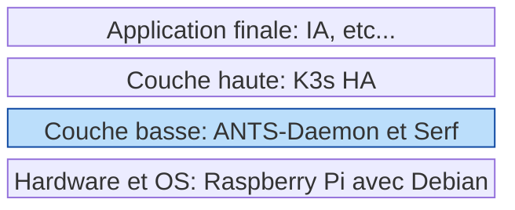

# Architecture logicielle de la solution

## Rappel du concept de couche

## ANTS-Daemon

- Aussi appelé `antsd`
- Langage: Go
- Possède toutes les logiques (bootstrap, nouveau join, récupération en cas d'échec, ...)
- Communique avec K3s (qu'en local, ou alors à la possiblité de joindre les autres nodes k3s ?)
- Communique avec Serf
    - soit serf installé en mode standalone, et donc communication IPC avec RPC, callback, ...
    - soit serf utilisé en mode "library go", donc inclus au sein du process antsd
    - choix retenu => lib embarqué
- Ne communique pas directement avec les autres nœuds, c'est Serf qui s'occupe de cela

Sera sous forme de machine d'état ?  
Mécanisme de jobs / planificateur de taches ?

Une boucle dédié à Serf (pour la surveillance des events, ...)  
Une boucle dédié à K3s ? (pour la surveillance des nodes afin d'avoir 2eme avis lors de panne ?)

## Serf

Serf doit rester simple et léger.
Pas de logiques dans les handlers, juste l'envoi et la réception de messages avec antsd.

## K3s

- Cluster HA avec etcd embedded

Pour déterminer qui sera le premier server, et les rôles de chaque node, voir
le [mécanisme de bootstrap](logics/bootstrap.md).

### Obstacle : Full K3s Server, sans Agent

Durant le PS, on a établi que pour se simplifier la vie, on ne va jamais utiliser des nodes avec le rôle "agent" de K3s.
On va installer que des serveurs.

Mais les servers contiennent une base de données etcd, et selon la doc, il ne faudrait pas avoir un cluster de >7
membres.
Le risque c'est des mauvaises performances.  
Source : https://etcd.io/docs/v3.6/faq/#what-is-maximum-cluster-size  
https://docs.k3s.io/architecture#high-availability-k3s

Solution proposée :

- on doit choisir quel node sera le premier server, puis avoir une logique pour déterminer si un node devient server ou
  agent

### Obstacle possible : Performances sur raspberry pi

https://docs.k3s.io/datastore/ha-embedded

> Embedded etcd (HA) may have performance issues on slower disks such as Raspberry Pis running with SD cards.

## Système d'exploitation

Possède :

- un binaire `k3s` complet (vers hors ligne, sans besoin de connexion internet)
- des images container embarqué (puisqu'on ne pourra pas les pull depuis internet)
- le binaire antsd (contient Serf), avec sa config
- un service systemd pour antsd (lancement au démarrage)
- paquets préinstallés (on ne pourra pas les installer avec apt depuis internet)
    - curl
    - htop
    - netstat
    - vim
    - TODO : autres

# Autres outils utiles :

### kube-vip

https://github.com/kube-vip/kube-vip  
Control Plane Virtual IP and Load-Balancer  
But : simplifier la construction d'un cluster Kubernetes HA
