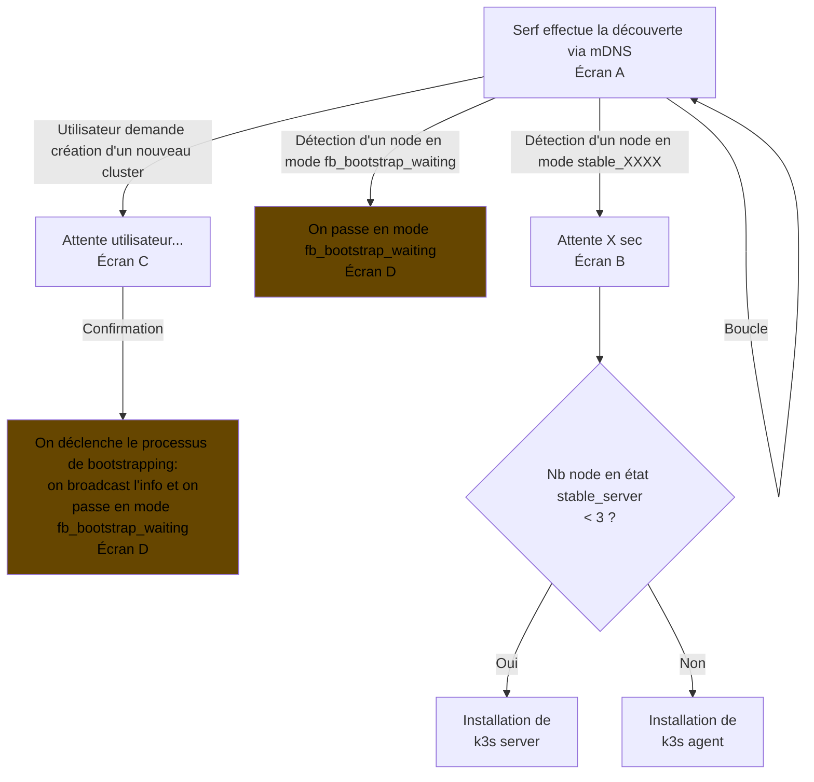
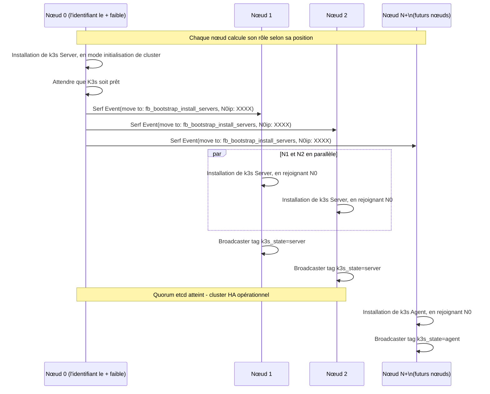

# Premier démarrage d'une machine

Dans ce fichier, on décrit ce qui se passe lorsqu'une machine démarre pour la première fois.  
On traite 2 cas :

1. Le client vient d'installer sa/ses premières machines, il n'y a donc pas de cluster existant.
2. Le client a déjà un cluster opérationnel, il ajoute une nouvelle machine à ce cluster.

Le cas suivant n'est pas traité :

- La machine a déjà effectué un démarrage auparavant : antsd n'aura pas le même comportement.

## Étapes principales

Après le démarrage de la machine, antsd et Serf sont exécutés, puis :

1. Attente de la découverte de l'ensemble des autres machines du réseau local, via Serf et le protocole mDNS
2. Une fois la découverte terminée soit :
    - Un cluster existe déjà : la machine le rejoint.
    - Aucun cluster n'existe : on lance le [processus de bootstrapping](#mécanisme-de-bootstrapping).

Ce qui nous donne les états suivants :

- `fb_discovering` : découverte des autres machines, affichage sur écran
- `fb_joining` : la machine a découvert un cluster, installe K3s et est en train de rejoindre le cluster
- `fb_joining_failed` : échec du processus de joining. la machine ne progresse plus
- `stable_XXXX` : la machine fait partie d'un cluster K3s, cet état ne fait plus partie du protocole de 1er démarrage
    - `stable_server` : la machine est un server K3s
    - `stable_agent` : la machine est un agent K3s
- `fb_bootstrap_XXXX` : la machine n'a découvert aucun cluster ET l'utilisateur à demander ce mode, elle est donc en
  train de lancer le processus de
  bootstrapping pour créer un nouveau cluster
    - `fb_bootstrap_confirm` : l'utilisateur a demandé la création d'un nouveau cluster, on attend sa confirmation
    - `fb_bootstrap_waiting` : confirmation ok, on attend avant de commencer le processus de bootstrapping pour
      s'assurer que toutes les machines aient eu l'info
    - `fb_bootstrap_install_init` : la machine N0 installe la toute première instance de K3s
    - `fb_bootstrap_install_servers` : les machines N1 et N2 installent K3s en mode server, en rejoignant le cluster de
      N0

Tous les états sont préfixés par "fb-" pour "first boot", afin de les différencier des états globaux du reste du cycle
de vie d'antsd.

## Interaction utilisateur avec l'écran embarqué sur la machine ANTS

Écran A:
> Status : découverte...  
> Nombre de machines découvertes : XX machines
>
> BTN --> Création d'un nouveau cluster ?

Écran B:
> Status : joining existing ANTS cluster...  
> Nombre de machines découvertes : XX machines

Écran C:
> Status : attente création d'un nouveau cluster ?  
> Nombre de machines découvertes : XX machines
>
> BTN --> Lorsque votre nombre de machines correspond à celui ci-dessus, appuyer ici...
> BTN --> Retour

L'écran C sert à la fois de confirmation, et permet d'être sûr qu'on commence le bootstrapping lorsque tous les nodes
ont été découverts (plutot que de se baser sur un long timer).

Écran D:
> Status : création d'un nouveau cluster...  
> Nombre de machines découvertes : XX machines

# Mécanisme de bootstrapping

Le mécanisme de bootstrapping est une sous-étape qui est déclenchée lorsqu'une machine démarre pour la première
fois, et qu'elle n'a découvert aucun cluster existant.

Dès qu'un dès node décide qu'il est nécéssaire de lancer le processus de bootstrapping, il en informe tous les autres
par broadcast, et tous les nodes passe donc en fb_bootstrap_waiting.  
En passant en mode fb_bootstrap_waiting, un timer local est démarré.  
La première machine dont le timer expire (donc la première à etre passée en fb_bootstrap_waiting) informe tous les
autres de passer en mode fb_bootstrap_install_init.

Ce diagramme montre le processus à partir de fb_bootstrap_install_init.

Tous les "Serf Event" sont en réalité en parallèle.

