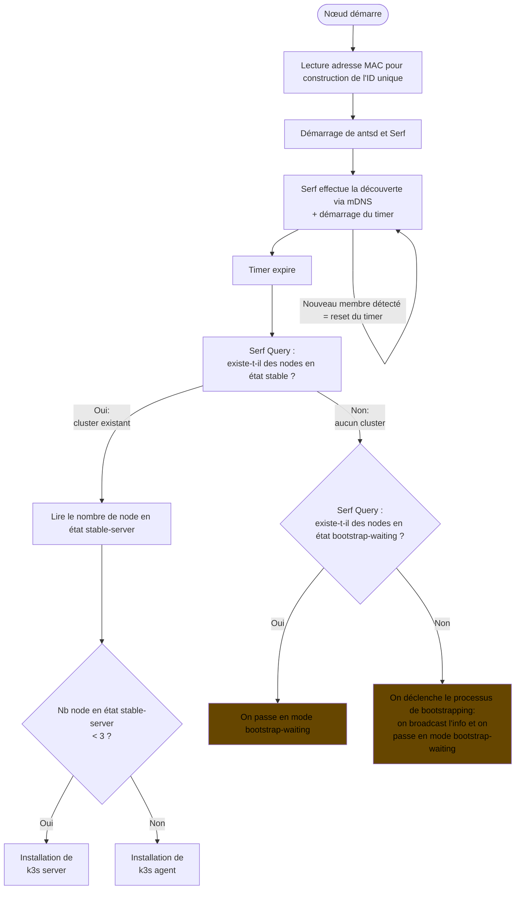

# Premier démarrage d'une machine

Dans cet exemple, une machine démarre pour la première fois.  
On traite 2 cas :

1. Le client vient d'installer sa/ses premières machines, il n'y a donc pas de cluster existant
2. Le client a déjà un cluster opérationnel, il ajoute une nouvelle machine à ce cluster

Les cas suivant ne sont pas traité :

- La machine a déjà effectué un démarrage auparavant : antsd n'aura pas le même comportement.

## Étapes principales

1. Démarrage de la machine, antsd et Serf sont exécutés
2. Attente de la découverte de l'ensemble des autres machines du réseau local, via Serf et le protocole mDNS
3. Une fois la découverte terminée (timer de X secondes après le dernier nouveau member découvert) soit :
    - Un cluster existe déjà : la machine le rejoint.
    - Aucun cluster n'existe : on attend encore une fois, afin que toutes les machines ait eu le temps de démarrer, puis
      on lance le [processus de bootstrapping](#mécanisme-de-bootstrapping).

Ce qui nous donne les états suivants :

- `starting` : étape 1
- `discovering` : étape 2, découverte des autres machines
- `joining` : étape 3, la machine a découvert un cluster, installe K3s et est en train de rejoindre le cluster
- `joining-failed` : échec du processus de joining. la machine ne progresse plus
- `stable-XXXX` : la machine fait partie d'un cluster K3s
    - `stable-server` : la machine est un server K3s
    - `stable-agent` : la machine est un agent K3s
- `bootstrap-XXXX` : la machine n'a découvert aucun cluster, elle est en train de lancer le processus de bootstrapping
  pour créer un nouveau cluster
    - `bootstrap-waiting` : on attend avant de commencer le processus de bootstrapping, pour s'assurer que toutes les
      machines aient eu le temps de démarrer
    - `bootstrap-install-init` : la machine N0 installe la toute première instance de K3s
    - `bootstrap-install-servers` : les machines N1 et N2 installent K3s en mode server, en rejoignant le cluster de N0

# Mécanisme de bootstrapping

Dès qu'un dès node décide qu'il est nécéssaire de lancer le processus de bootstrapping, il en informe tous les autres
par broadcast, et tous les nodes passe donc en bootstrap-waiting.
En passant en mode bootstrap-waiting, un timer local est démarré.
La première machine dont le timer expire (donc la première à etre passée en bootstrap-waiting) informe tous les autres
de passer en mode bootstrap-install-init.

Ce diagramme montre le processus à partir de bootstrap-install-init.

Tous les "Serf Event" sont en réalité en parallèle.

