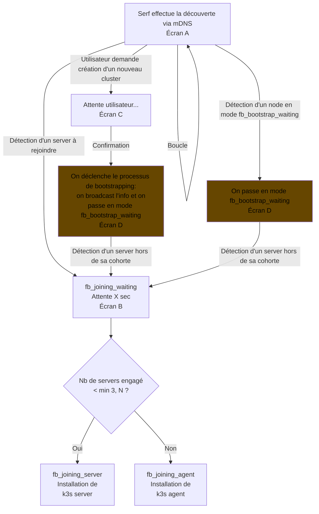
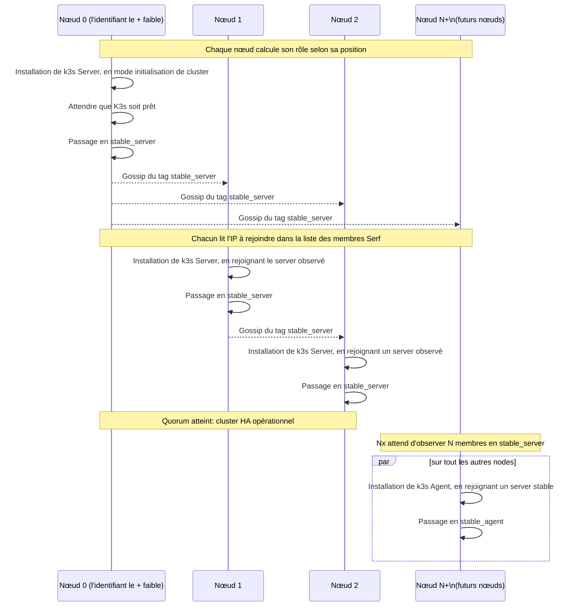

# Premier démarrage d'une machine

Dans ce fichier, on décrit ce qui se passe lorsqu'une machine démarre pour la première fois.  
On traite 2 cas :

1. Le client vient d'installer sa/ses premières machines, il n'y a donc pas de cluster existant.
2. Le client a déjà un cluster opérationnel, il ajoute une nouvelle machine à ce cluster.

Le cas suivant n'est pas traité ici :

- La machine a déjà effectué un démarrage auparavant : antsd prend le chemin `rejoin_cluster` et ne fait aucune des
  étapes décrites dans ce fichier.

## Étapes principales

Après le démarrage de la machine, antsd et Serf sont exécutés, puis :

1. Attente de la découverte de l'ensemble des autres machines du réseau local, via Serf et le protocole mDNS
2. Une fois la découverte terminée soit :
    - Un cluster existe déjà : la machine le rejoint.
    - Aucun cluster n'existe : on lance le [processus de bootstrapping](#mécanisme-de-bootstrapping).

Ce qui nous donne les états suivants :

- `fb_discovering` : découverte des autres machines, affichage sur écran
- `fb_joining_XXXX` : la machine a découvert un cluster existant, elle le rejoint (aucune action utilisateur)
    - `fb_joining_waiting` : un server à rejoindre a été vu, on laisse le membership se stabiliser avant de décider du
      rôle
    - `fb_joining_server` : la machine installe K3s en mode server
    - `fb_joining_agent` : la machine installe K3s en mode agent
    - `fb_joining_failed` : échec du processus de joining. la machine ne progresse plus
- `stable_XXXX` : la machine fait partie d'un cluster K3s, cet état ne fait plus partie du protocole de 1er démarrage
    - `stable_server` : la machine est un server K3s
    - `stable_agent` : la machine est un agent K3s
- `fb_bootstrap_XXXX` : la machine n'a découvert aucun cluster ET l'utilisateur à demander ce mode, elle est donc en
  train de lancer le processus de
  bootstrapping pour créer un nouveau cluster
    - `fb_bootstrap_confirm` : l'utilisateur a demandé la création d'un nouveau cluster, on attend sa confirmation
    - `fb_bootstrap_waiting` : confirmation ok, on attend avant de commencer le processus de bootstrapping pour
      s'assurer que toutes les machines aient eu l'info
    - `fb_bootstrap_install_init` : la machine N0 installe la toute première instance de K3s
    - `fb_bootstrap_install_servers` : les machines N1 et N2 installent K3s en mode server, en rejoignant le cluster de
      N0
    - `fb_bootstrap_install_agent` : les machines N3+ installent K3s en mode agent, en rejoignant le cluster de N0
    - `fb_bootstrap_failed` : échec du processus de bootstrapping, la machine ne progresse plus. Soit : le
      script d'installation K3s retourne une erreur, ou le K3s fraîchement installé ne se déclare pas prêt dans les
      5 minutes.

Tous les états sont préfixés par "fb-" pour "first boot", afin de les différencier des états globaux du reste du cycle
de vie d'antsd.

```mermaid
flowchart TD
    A[Serf effectue la découverte via mDNS\nÉcran A]
    A -- Boucle --> A
    A -- Utilisateur demande création d'un nouveau cluster --> B[Attente utilisateur...\nÉcran C]
    B -- Confirmation --> C[On déclenche le processus de bootstrapping:\n on broadcast l'info et on passe en mode fb_bootstrap_waiting\nÉcran D]
    A -- Détection d'un node en mode fb_bootstrap_waiting --> D[On passe en mode fb_bootstrap_waiting\nÉcran D]
    A -- Détection d'un server à rejoindre --> E[fb_joining_waiting\nAttente X sec\nÉcran B]
    C -- Détection d'un server hors de sa cohorte --> E
    D -- Détection d'un server hors de sa cohorte --> E
    E --> J{Nb de servers engagé\n< min 3, N ?}
    J -- Oui --> K[fb_joining_server\nInstallation de \nk3s server]
    J -- Non --> L[fb_joining_agent\nInstallation de \nk3s agent]
    style C fill: #664600, color: #000
    style D fill: #664600, color: #000
```

## Interaction utilisateur avec l'écran embarqué sur la machine ANTS

Écran A:
> Status : découverte...  
> Nombre de machines découvertes : XX machines
>
> BTN --> Création d'un nouveau cluster ?

Écran B:
> Status : joining existing ANTS cluster...  
> Nombre de machines découvertes : XX machines

Écran C:
> Status : attente création d'un nouveau cluster ?  
> Nombre de machines découvertes : XX machines
>
> BTN --> Lorsque votre nombre de machines correspond à celui ci-dessus, appuyer ici...
> BTN --> Retour

L'écran C sert à la fois de confirmation, et permet d'être sûr qu'on commence le bootstrapping lorsque tous les nodes
ont été découverts (plutot que de se baser sur un long timer).

Écran D:
> Status : création d'un nouveau cluster...  
> Nombre de machines découvertes : XX machines

**Implémentation sur Pis** : l'écran physique étant inexistant, les boutons sont simulés par des endpoints HTTP :

- `POST /bootstrap` = bouton de l'écran A (demande de création)
- `POST /bootstrap/confirm` = bouton de confirmation de l'écran C
- `POST /bootstrap/cancel` = bouton retour de l'écran C

# Mécanisme de bootstrapping

Le mécanisme de bootstrapping est une sous-étape qui est déclenchée lorsqu'une machine démarre pour la première
fois, et qu'elle n'a découvert aucun cluster existant.

Dès qu'un dès node décide qu'il est nécéssaire de lancer le processus de bootstrapping, il en informe tous les autres
par broadcast, et tous les nodes passe donc en `fb_bootstrap_waiting`.  
En passant en mode `fb_bootstrap_waiting`, un timer local est démarré.  
La première machine dont le timer expire broadcast le signal de départ : chaque node calcule alors son rôle.  
Seul N0 passe en `fb_bootstrap_install_init`, les autres restent en `fb_bootstrap_waiting`. La condition de sortie n'est
pas la même selon le rôle :

- N1 et N2 (server) attendent d'observer autant de membres en `stable_server` que leur rang : N1 en attend 1
  (donc N0), N2 en attend 2 (N0 et N1). Ils s'installent ainsi l'un après l'autre. Le/les membres observés leur
  donne la cible à rejoindre.
- N3+ (agent) attendent le quorum complet, soit `min(3, N)` membres en `stable_server`.

Les servers s'installent séquentiellement parce qu'etcd n'admet qu'un seul ajout à la fois : deux join
simultanés ne sont pas bien supportés. Durant des tests, la charge combinée a suffi à bloquer l'etcd du
nœud rejoint (N0) assez longtemps pour qu'il perde son bail de leader et redémarre.
Par contre, les agents ne touchent pas au membership etcd : ils peuvent donc rejoindre en même temps.

Non traitée pour l'instant : si un des servers échoue son installation, les machines N3+ restent
bloquées indéfiniment en `fb_bootstrap_waiting`, puisque le quorum attendu ne sera jamais atteint.
Le recovery actuellement proposé est de faire un factory reset de la machine en échec (voir plus bas).

### Événements Serf du protocole

Le protocole repose sur 2 user events Serf (broadcast à tout le monde, y compris l'émetteur ; les handlers sont
idempotents : un événement reçu dans un état inattendu est ignoré, ce qui absorbe les doublons) :

| Événement                   | Émetteur                            | Payload | Effet                                                                       |
|-----------------------------|-------------------------------------|---------|-----------------------------------------------------------------------------|
| `antsd:bootstrap-requested` | le node dont l'utilisateur confirme | -       | tous les nodes en premier démarrage passent en `fb_bootstrap_waiting`       |
| `antsd:bootstrap-start`     | 1er node dont le timer expire       | -       | chaque node calcule son rôle (rang dans la liste triée des membres vivants) |

Le nombre de servers vaut `min(3, N)` : avec 1 ou 2 machines, il n'y a simplement pas d'agent.

L'adresse du server à rejoindre ne transite pas par un event.  
Elle est déduite grâce à la liste de membre de Serf : le membre alive au nom le plus petit dont l'état est
`stable_server`.
N'importe quel server déjà installé est une cible de join valide pour K3s.

Ce diagramme montre le processus à partir de `fb_bootstrap_install_init`.

La propagation du tag est en réalité parallèle vers tous les nodes.

```mermaid
sequenceDiagram
    participant N0 as Nœud 0 (l'identifiant le + faible)
    participant N1 as Nœud 1
    participant N2 as Nœud 2
    participant Nx as Nœud N+\n(futurs nœuds)
    note over N0, Nx: Chaque nœud calcule son rôle selon sa position
    N0 ->> N0: Installation de k3s Server, en mode initialisation de cluster
    N0 ->> N0: Attendre que K3s soit prêt
    N0 ->> N0: Passage en stable_server
    N0 -->> N1: Gossip du tag stable_server
    N0 -->> N2: Gossip du tag stable_server
    N0 -->> Nx: Gossip du tag stable_server
    note over N0, Nx: Chacun lit l'IP à rejoindre dans la liste des membres Serf
    N1 ->> N1: Installation de k3s Server, en rejoignant le server observé
    N1 ->> N1: Passage en stable_server
    N1 -->> N2: Gossip du tag stable_server
%%    normalement, on devrait aussi montrer que le gossip va vers N0 et N3 mais bon, ca serait un peu lourd
    N2 ->> N2: Installation de k3s Server, en rejoignant un server observé
    N2 ->> N2: Passage en stable_server
    note over N0, N2: Quorum atteint: cluster HA opérationnel
    note over Nx: Nx attend d'observer N membres en stable_server
    par sur tout les autres nodes
        Nx ->> Nx: Installation de k3s Agent, en rejoignant un server stable
        Nx ->> Nx: Passage en stable_agent
    end
```

# Mécanisme de joining

Le mécanisme de joining est l'autre sous-étape du premier démarrage : une machine vierge est branchée à côté d'un
cluster qui tourne déjà. Contrairement au bootstrapping, il ne demande aucune action utilisateur : la machine
s'ajoute toute seule.

### Déclencheur

Le déclencheur est la présence d'une **cible de join** : un membre Serf alive dont l'état est `stable_server`.
Il est évalué à chaque événement Serf (une machine qui arrive tard reçoit le tag), et pas une seule fois au démarrage.

Cela vaut aussi pour une machine déjà engagée dans un bootstrapping (`fb_discovering`, `fb_bootstrap_confirm`,
`fb_bootstrap_waiting`) : si le server observé n'appartient pas à **sa propre cohorte** (la liste des membres à partir
de laquelle elle a calculé son rôle), elle abandonne le bootstrapping et passe en `fb_joining_waiting`.
Sans ça, seul N0 refuserait (voir les GUARDS plus bas) : toutes les autres machines de la cohorte
verraient le server étranger dans les tags Serf et le rejoindraient avec un rôle calculé sur la mauvaise population.

On ne se déclenche volontairement pas sur "un membre appartient déjà à un cluster ?", qui est plus large : un cluster
dont tous les servers sont en `rejoin_cluster` ou `failed` n'est pas rejoignable.

### Choix du rôle

`fb_joining_waiting` démarre un timer, comme `fb_bootstrap_waiting` : le rôle dépend de ce qu'on voit du cluster, il
faut laisser le membership arriver. La décision est ensuite réévaluée à chaque événement Serf.

Un slot de server est libre si `nb de servers engagés < min(3, nb de machines connues)` :

- **engagé** signifie être un server ou être en train d'en installer un (`stable_server`,
  `fb_bootstrap_install_init`, `fb_bootstrap_install_servers`, `fb_joining_server`). Compter les installations en
  cours évite que deux machines visent le même slot.
- **connu** et **engagé** comptent les membres `failed` : un server tombé garde sa place, le remplacer est la
  responsabilité du rescaling, pas du joining. Seul un membre `left` (décommissionné) sort du compte.

Si un slot est libre, la machine s'installe en server, sinon en agent.

Comme pour le bootstrapping, les servers s'installent un à la fois (contrainte etcd) et les agents en parallèle.
Mais le rang du bootstrapping ne peut pas servir ici : les machines arrivent à des instants arbitraires. Le tour est
donc pris par la machine au nom le plus petit parmi celles en `fb_joining_waiting`, et seulement si aucune machine du
cluster ne modifie le membership etcd à cet instant (`fb_bootstrap_install_init`, `fb_bootstrap_install_servers`,
`fb_joining_server`, et `rejoin_cluster`).

`rejoin_cluster` en fait partie meme si un redémarrage n'ajoute aucun membre etcd : c'est un server potentiellement
absent du quorum, et faire grossir etcd pendant ce temps est risqué. Contrairement aux comptages de slots, seuls les
membres **alive** sont regardés.
Donc une machine vivante bloquée longtemps en `rejoin_cluster` (K3s installé mais n'arrive pas à démarrer, antsd attend
indéfiniment) empêche le join d'un server.

Un agent, n'attend pas le quorum complet contrairement au bootstrapping.

## Échec pendant le premier démarrage

Une machine dont l'installation K3s échoue termine en état terminal `fb_bootstrap_failed`, ou `fb_joining_failed`
selon la branche empruntée.

La procédure de reprise est un factory reset de cette machine, et pas un simple redémarrage :

- `becomeStable` est le seul endroit qui écrit le fichier d'état, donc une machine tombée en `fb_bootstrap_failed` n'en
  a pas. Mais elle peut avoir un K3s installé, par exemple si l'échec est le timeout de 5 min sur la
  probe de readiness : le script d'installation a réussi, et la machine est peut-être déjà membre de l'etcd.
  Un redémarrage relance K3s (car il est enable dans systemd) pendant qu'antsd (qui ne trouve pas de fichier d'état)
  relance le premier démarrage et réinstalle par-dessus des données.
- Un factory reset (uninstall K3s + suppression du fichier persisté) est plus sûr.

Réinitialiser toutes les machines n'est pas utile : les servers déjà installés forment un cluster qui fonctionne.
En plus cela demande à l'utilisateur une plus grande implication.
Donc la machine dont l'écran affiche l'échec est celle qu'on réinitialise.

Deux protections rendent cette procédure plus sûre :

- **Aucune installation K3s sur une machine non vierge.** Avant chaque installation du first-boot (bootstrapping ou
  joining), antsd vérifie qu'aucun systemd unit K3s n'existe (avec `InstalledRole`). Si une installation est trouvée,
  le nœud refuse et demande un factory reset.
- **Aucune création de cluster à côté d'un cluster existant.** Un membre Serf appartenant déjà à un cluster fait
  refuser le bouton de l'écran A, et fait refuser le `--cluster-init` à N0 si le cluster n'apparaît qu'après.
  Les membres `failed` comptent aussi : un nœud tombé peut revenir, et il reviendra avec ses données K3s.