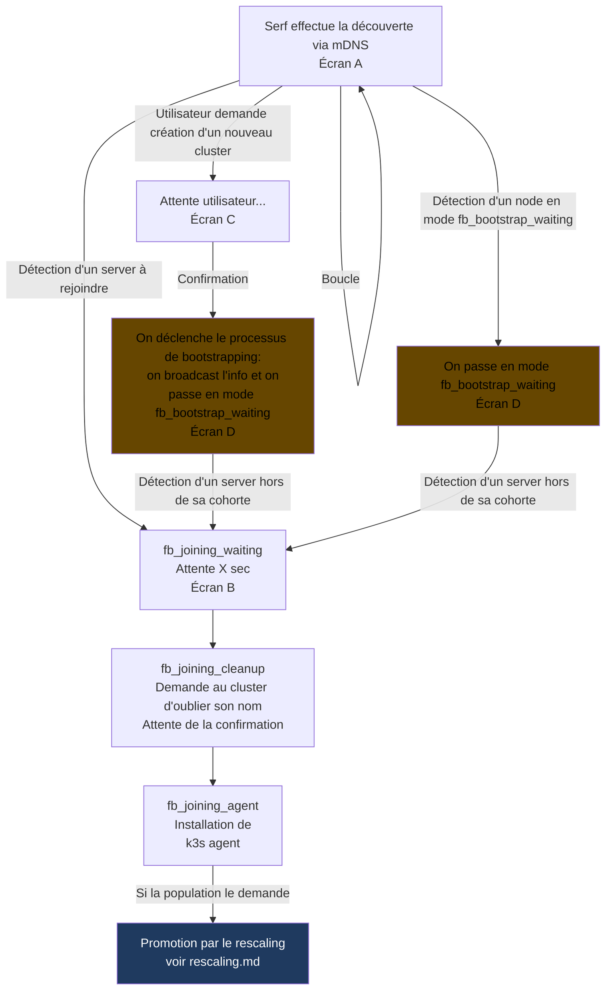
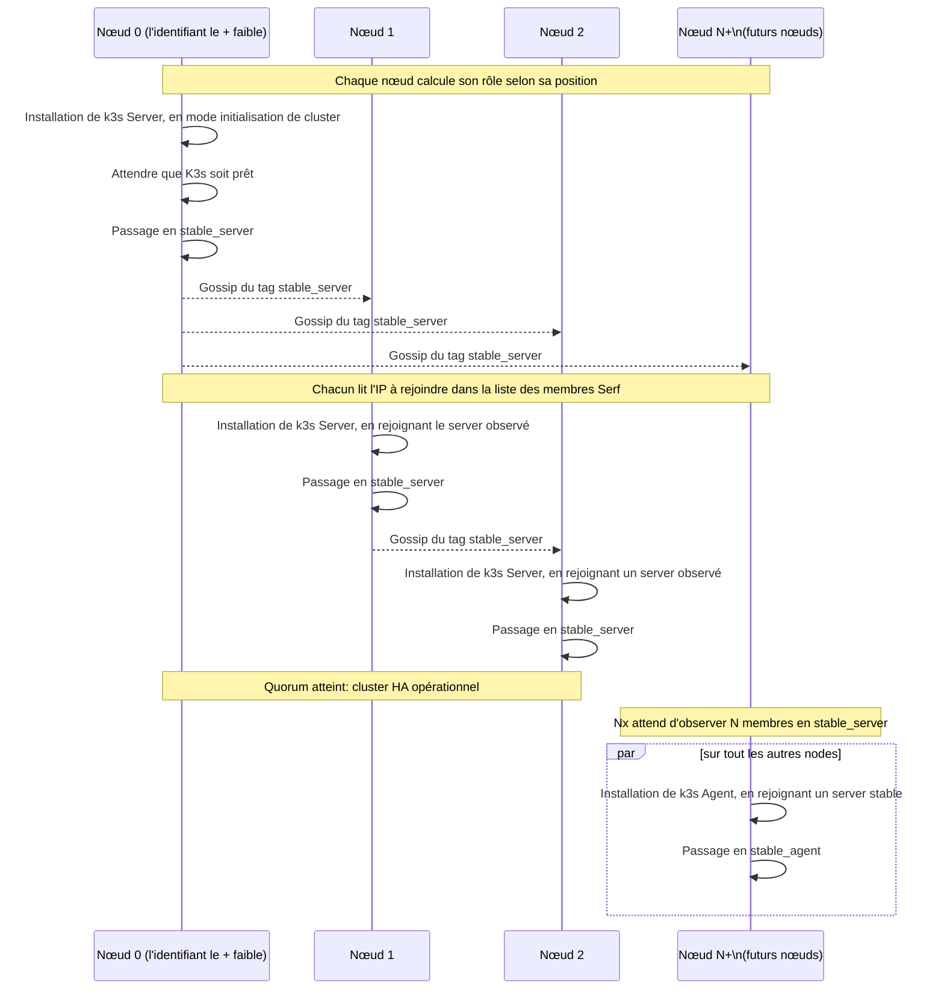

# Premier démarrage d'une machine

Dans ce fichier, on décrit ce qui se passe lorsqu'une machine démarre pour la première fois.  
On traite 2 cas :

1. Le client vient d'installer sa/ses premières machines, il n'y a donc pas de cluster existant.
2. Le client a déjà un cluster opérationnel, il ajoute une nouvelle machine à ce cluster.

Le cas suivant n'est pas traité ici :

- La machine a déjà effectué un démarrage auparavant : antsd prend le chemin `rejoin_cluster` et ne fait aucune des
  étapes décrites dans ce fichier.

## Étapes principales

Après le démarrage de la machine, antsd et Serf sont exécutés, puis :

1. Attente de la découverte de l'ensemble des autres machines du réseau local, via Serf et le protocole mDNS
2. Une fois la découverte terminée soit :
    - Un cluster existe déjà : la machine le rejoint.
    - Aucun cluster n'existe : on lance le [processus de bootstrapping](#mécanisme-de-bootstrapping).

Ce qui nous donne les états suivants :

- `fb_discovering` : découverte des autres machines, affichage sur écran
- `fb_joining_XXXX` : la machine a découvert un cluster existant, elle le rejoint (aucune action utilisateur)
    - `fb_joining_waiting` : un server à rejoindre a été vu, on laisse le membership se stabiliser avant de choisir la
      cible du join
    - `fb_joining_cleanup` : la machine demande au cluster d'oublier le nœud K3s qu'il connaît peut-être encore sous son
      nom, et attend la confirmation (voir [protocole forget-me](#protocole-forget-me))
    - `fb_joining_agent` : la machine installe K3s en mode agent.
    - `fb_joining_failed` : échec du processus de joining. la machine ne progresse plus
- `stable_XXXX` : la machine fait partie d'un cluster K3s, cet état ne fait plus partie du protocole de 1er démarrage
    - `stable_server` : la machine est un server K3s
    - `stable_agent` : la machine est un agent K3s
- `fb_bootstrap_XXXX` : la machine n'a découvert aucun cluster ET l'utilisateur à demander ce mode, elle est donc en
  train de lancer le processus de
  bootstrapping pour créer un nouveau cluster
    - `fb_bootstrap_confirm` : l'utilisateur a demandé la création d'un nouveau cluster, on attend sa confirmation
    - `fb_bootstrap_waiting` : confirmation ok, on attend avant de commencer le processus de bootstrapping pour
      s'assurer que toutes les machines aient eu l'info
    - `fb_bootstrap_install_init` : la machine N0 installe la toute première instance de K3s
    - `fb_bootstrap_install_servers` : les machines N1 et N2 installent K3s en mode server, en rejoignant le cluster de
      N0
    - `fb_bootstrap_install_agent` : les machines N3+ installent K3s en mode agent, en rejoignant le cluster de N0
    - `fb_bootstrap_failed` : échec du processus de bootstrapping, la machine ne progresse plus. Soit : le
      script d'installation K3s retourne une erreur, ou l'installation ne se déclare pas prête dans les 10 minutes
      (ce délai couvre le script d'installation et la probe de readiness).

Tous les états sont préfixés par "fb-" pour "first boot", afin de les différencier des états globaux du reste du cycle
de vie d'antsd.

```mermaid
flowchart TD
    A[Serf effectue la découverte via mDNS\nÉcran A]
    A -- Boucle --> A
    A -- Utilisateur demande création d'un nouveau cluster --> B[Attente utilisateur...\nÉcran C]
    B -- Confirmation --> C[On déclenche le processus de bootstrapping:\n on broadcast l'info et on passe en mode fb_bootstrap_waiting\nÉcran D]
    A -- Détection d'un node en mode fb_bootstrap_waiting --> D[On passe en mode fb_bootstrap_waiting\nÉcran D]
    A -- Détection d'un server à rejoindre --> E[fb_joining_waiting\nAttente X sec\nÉcran B]
    C -- Détection d'un server hors de sa cohorte --> E
    D -- Détection d'un server hors de sa cohorte --> E
    E --> K[fb_joining_cleanup\nDemande au cluster d'oublier son nom\nAttente de la confirmation]
    K --> L[fb_joining_agent\nInstallation de \nk3s agent]
    L -- Si la population le demande --> M[Promotion par le rescaling\nvoir rescaling.md]
    style C fill: #664600, color: #000
    style D fill: #664600, color: #000
    style M fill: #1f3a5f, color: #fff
```

## Interaction utilisateur avec l'écran embarqué sur la machine ANTS

Écran A:
> Status : découverte...  
> Nombre de machines découvertes : XX machines
>
> BTN --> Création d'un nouveau cluster ?

Écran B:
> Status : joining existing ANTS cluster...  
> Nombre de machines découvertes : XX machines

Écran C:
> Status : attente création d'un nouveau cluster ?  
> Nombre de machines découvertes : XX machines
>
> BTN --> Lorsque votre nombre de machines correspond à celui ci-dessus, appuyer ici...
> BTN --> Retour

L'écran C sert à la fois de confirmation, et permet d'être sûr qu'on commence le bootstrapping lorsque tous les nodes
ont été découverts (plutot que de se baser sur un long timer).

Écran D:
> Status : création d'un nouveau cluster...  
> Nombre de machines découvertes : XX machines

**Implémentation sur Pis** : l'écran physique étant inexistant, les boutons sont simulés par des endpoints HTTP :

- `POST /bootstrap` = bouton de l'écran A (demande de création)
- `POST /bootstrap/confirm` = bouton de confirmation de l'écran C
- `POST /bootstrap/cancel` = bouton retour de l'écran C

# Mécanisme de bootstrapping

Le mécanisme de bootstrapping est une sous-étape qui est déclenchée lorsqu'une machine démarre pour la première
fois, et qu'elle n'a découvert aucun cluster existant.

Dès qu'un dès node décide qu'il est nécéssaire de lancer le processus de bootstrapping, il en informe tous les autres
par broadcast, et tous les nodes passe donc en `fb_bootstrap_waiting`.  
En passant en mode `fb_bootstrap_waiting`, un timer local est démarré.  
La première machine dont le timer expire broadcast le signal de départ : chaque node calcule alors son rôle.  
Seul N0 passe en `fb_bootstrap_install_init`, les autres restent en `fb_bootstrap_waiting`. La condition de sortie n'est
pas la même selon le rôle :

- N1 et N2 (server) attendent d'observer autant de membres en `stable_server` que leur rang : N1 en attend 1
  (donc N0), N2 en attend 2 (N0 et N1). Ils s'installent ainsi l'un après l'autre. Le/les membres observés leur
  donne la cible à rejoindre.
- N3+ (agent) attendent le quorum complet, soit `min(3, N)` membres en `stable_server`.

Les servers s'installent séquentiellement parce qu'etcd n'admet qu'un seul ajout à la fois : deux join
simultanés ne sont pas bien supportés. Durant des tests, la charge combinée a suffi à bloquer l'etcd du
nœud rejoint (N0) assez longtemps pour qu'il perde son bail de leader et redémarre.
Par contre, les agents ne touchent pas au membership etcd : ils peuvent donc rejoindre en même temps.

Non traitée pour l'instant : si un des servers échoue son installation, les machines N3+ restent
bloquées indéfiniment en `fb_bootstrap_waiting`, puisque le quorum attendu ne sera jamais atteint.
Le recovery actuellement proposé est de faire un factory reset de la machine en échec (voir plus bas).

### Événements Serf du protocole

Le protocole repose sur 2 user events Serf (broadcast à tout le monde, y compris l'émetteur ; les handlers sont
idempotents : un événement reçu dans un état inattendu est ignoré, ce qui absorbe les doublons) :

| Événement                   | Émetteur                            | Payload | Effet                                                                       |
|-----------------------------|-------------------------------------|---------|-----------------------------------------------------------------------------|
| `antsd:bootstrap-requested` | le node dont l'utilisateur confirme | -       | tous les nodes en premier démarrage passent en `fb_bootstrap_waiting`       |
| `antsd:bootstrap-start`     | 1er node dont le timer expire       | -       | chaque node calcule son rôle (rang dans la liste triée des membres vivants) |

Le nombre de servers vaut `min(3, N)` : avec 1 ou 2 machines, il n'y a simplement pas d'agent.

L'adresse du server à rejoindre ne transite pas par un event.  
Elle est déduite grâce à la liste de membre de Serf : le membre alive au nom le plus petit dont l'état est
`stable_server`.
N'importe quel server déjà installé est une cible de join valide pour K3s.

Ce diagramme montre le processus à partir de `fb_bootstrap_install_init`.

La propagation du tag est en réalité parallèle vers tous les nodes.

```mermaid
sequenceDiagram
    participant N0 as Nœud 0 (l'identifiant le + faible)
    participant N1 as Nœud 1
    participant N2 as Nœud 2
    participant Nx as Nœud N+\n(futurs nœuds)
    note over N0, Nx: Chaque nœud calcule son rôle selon sa position
    N0 ->> N0: Installation de k3s Server, en mode initialisation de cluster
    N0 ->> N0: Attendre que K3s soit prêt
    N0 ->> N0: Passage en stable_server
    N0 -->> N1: Gossip du tag stable_server
    N0 -->> N2: Gossip du tag stable_server
    N0 -->> Nx: Gossip du tag stable_server
    note over N0, Nx: Chacun lit l'IP à rejoindre dans la liste des membres Serf
    N1 ->> N1: Installation de k3s Server, en rejoignant le server observé
    N1 ->> N1: Passage en stable_server
    N1 -->> N2: Gossip du tag stable_server
%%    normalement, on devrait aussi montrer que le gossip va vers N0 et N3 mais bon, ca serait un peu lourd
    N2 ->> N2: Installation de k3s Server, en rejoignant un server observé
    N2 ->> N2: Passage en stable_server
    note over N0, N2: Quorum atteint: cluster HA opérationnel
    note over Nx: Nx attend d'observer N membres en stable_server
    par sur tout les autres nodes
        Nx ->> Nx: Installation de k3s Agent, en rejoignant un server stable
        Nx ->> Nx: Passage en stable_agent
    end
```

# Mécanisme de joining

Le mécanisme de joining est l'autre sous-étape du premier démarrage : une machine vierge est branchée à côté d'un
cluster qui tourne déjà. Contrairement au bootstrapping, il ne demande aucune action utilisateur : la machine
s'ajoute toute seule.

### Déclencheur

Le déclencheur est la présence d'une **cible de join** : un membre Serf alive dont l'état est `stable_server`.
Il est évalué à chaque événement Serf (une machine qui arrive tard reçoit le tag), et pas une seule fois au démarrage.

Cela vaut aussi pour une machine déjà engagée dans un bootstrapping (`fb_discovering`, `fb_bootstrap_confirm`,
`fb_bootstrap_waiting`) : si le server observé n'appartient pas à **sa propre cohorte** (la liste des membres à partir
de laquelle elle a calculé son rôle), elle abandonne le bootstrapping et passe en `fb_joining_waiting`.
Sans ça, seul N0 refuserait (voir les GUARDS plus bas) : toutes les autres machines de la cohorte
verraient le server étranger dans les tags Serf et le rejoindraient avec un rôle calculé sur la mauvaise population.

On ne se déclenche volontairement pas sur "un membre appartient déjà à un cluster ?", qui est plus large : un cluster
dont tous les servers sont en `rejoin_cluster` ou `failed` n'est pas rejoignable.

### Choix du rôle

Une machine qui rejoint un cluster existant s'installe toujours en agent. Si la population nécessite un server de
plus, c'est le coordinateur du [rescaling](rescaling.md) qui la promeut ensuite. Le joining ne dimensionne jamais le
control plane.

`fb_joining_waiting` démarre quand même un timer, comme `fb_bootstrap_waiting` : il laisse le membership arriver avant
de choisir la cible du join. La décision est réévaluée à chaque événement Serf.
Une machine qui ne voit plus aucun server joignable attend, elle ne retombe jamais sur le bootstrapping.

Les agents ne touchent pas au membership etcd, donc les machines qui arrivent s'installent en parallèle, sans prendre le
mutex `isEtcdMembershipChanging()`. La seule exception est le protocole ci-dessous, et uniquement pour une machine qui
a réellement des restes à effacer.

### Protocole forget-me

Avant d'installer quoi que ce soit, la machine passe par `fb_joining_cleanup` :

1. elle vérifie localement qu'aucun K3s n'est installé chez elle (`ensureK3sIsNotInstalled`),
2. elle diffuse `antsd:forget-me {name}`,
3. le coordinateur cherche un nœud K3s portant ce nom, l'efface s'il existe, et répond `antsd:forgotten {name}`,
4. la machine installe son agent.

Pourquoi :  
Une remise à zéro est purement locale : le bouton physique est piloté par un firmware qui ne sait rien du
cluster, d'antsd, etc., donc la machine ne peut rien demander en partant.
Le cluster garde alors un fantôme d'elle : son objet `Node` et son membre etcd si elle était server.
Comme le nom est dérivé de l'adresse MAC, elle revient avec le même, et le fantôme devient problématique :
K3s refuse d'enregistrer un nœud dont le mot de passe ne
correspond plus au secret conservé, et un membre etcd fantôme garde sa place dans le quorum, ce qui bloque toute
promotion ultérieure.
L'éviction du rescaling ne peut pas intervenir puisqu'elle ne retire que les machines que Serf
voit en panne, et celle-ci est de retour et vivante (c'est ce qui est logique après une remise à zéro).

La machine attend indéfiniment la confirmation, et n'installe jamais sans elle.

Le coordinateur commence par une simple lecture (`NodeExists`), qui ne coute rien : une machine dont
le cluster ne sait rien est confirmée immédiatement, même pendant si une conversion est en cours par exemple.
Seule une machine qui a réellement des restes attend, parce que les effacer peut emporter un membre etcd.

Deux GUARD :

- **Locale**, avant de demander : une machine qui a un K3s installé mais pas de fichier d'état rejoue le premier
  démarrage alors que son K3s tourne et est enregistré. Elle s'arrête donc avant de
  demander, en `fb_joining_failed` : cette machine demande une remise à zéro.
- **Coordinateur** : il n'efface que le nom d'un membre que Serf voit vivant et en premier démarrage
  (`isVirginMember`). Si le membre est déjà stable, il ne l'efface pas.

Limite connue : un membre etcd dont l'objet `Node` n'a jamais été créé reste invisible.
C'est possible si l'installation d'un server expire entre l'ajout du membre etcd et l'enregistrement du kubelet.
C'est un cas rare, qui demanderait une interface au niveau de l'etcd (ce qui est pas forcément souhaitable).

#### Pourquoi pas de join en server

La première version choisissait le rôle : un slot de server était libre si
`nb de servers engagés < DesiredServerCount(population)`, et la machine s'installait alors en server.
Ce mécanisme a été retiré après un test sur les raspberry, pour deux raisons.

1. Une machine qui démarre **après** une panne n'apprend jamais l'existence du membre tombé. La panne n'entre donc
   jamais
   dans son memberlist. Le test : une 4eme machine démarre à côté d'un cluster de 3 (dont 1 server down) ne voyait
   que 3 membres au lieu de 4 : elle comptait 2 servers pour 3 machines, croyait un slot libre, et s'installait en
   server.

2. etcd refuse de grossir pendant qu'un de ses membres est injoignable. C'est le `strict-reconfig-check` d'etcd . La
   règle est la même que celle du rescaling (éviction avant promotion) : il faut retirer le membre mort
   avant d'en ajouter un. Or `fb_joining_server` faisait partie du mutex etcd, donc la machine bloquée y retenait
   justement le mutex dont l'éviction du membre mort avait besoin : deadlock.

Faire décider le coordinateur (un `stable_server` qui voit tout le cluster) supprime le problème.
Le coût est un cycle d'installation supplémentaire pour une machine destinée à devenir server : agent d'abord,
conversion ensuite.

Au final, on est revenu à la première intuition : joining reste simple, la logique de server/agent est dans rescaling.

## Échec pendant le premier démarrage

Une machine dont l'installation K3s échoue termine en état terminal `fb_bootstrap_failed`, ou `fb_joining_failed`
selon la branche empruntée.

La procédure de reprise est un factory reset de cette machine, et pas un simple redémarrage :

- `becomeStable` est le seul endroit qui écrit le fichier d'état, donc une machine tombée en `fb_bootstrap_failed` n'en
  a pas. Mais elle peut avoir un K3s installé, par exemple si l'échec est le timeout de 10 min : le script
  d'installation a réussi, et la machine est peut-être déjà membre de l'etcd.
  Un redémarrage relance K3s (car il est enable dans systemd) pendant qu'antsd (qui ne trouve pas de fichier d'état)
  relance le premier démarrage et réinstalle par-dessus des données.
- Un factory reset (uninstall K3s + suppression du fichier persisté) est plus sûr.

Réinitialiser toutes les machines n'est pas utile : les servers déjà installés forment un cluster qui fonctionne.
En plus cela demande à l'utilisateur une plus grande implication.
Donc la machine dont l'écran affiche l'échec est celle qu'on réinitialise.

Trois protections rendent cette procédure plus sûre :

- **Aucune installation K3s sur une machine non vierge.** Avant chaque installation du first-boot (bootstrapping ou
  joining), antsd vérifie qu'aucun systemd unit K3s n'existe (avec `InstalledRole`). Si une installation est trouvée,
  le nœud refuse et demande un factory reset.
- **Aucune création de cluster à côté d'un cluster existant.** Un membre Serf appartenant déjà à un cluster fait
  refuser le bouton de l'écran A, et fait refuser le `--cluster-init` à N0 si le cluster n'apparaît qu'après.
  Les membres `failed` comptent aussi : un nœud tombé peut revenir, et il reviendra avec ses données K3s.
- **Aucune installation avant que le cluster ait oublié la vie précédente de la machine.** La remise à zéro n'efface
  que le disque local, donc le cluster garde l'objet `Node` et le membre etcd de la machine réinitialisée.
  C'est le [protocole forget-me](#protocole-forget-me) qui les supprime, à son retour.

### Ce que la remise à zéro ne peut pas faire

La remise à zéro est locale par construction : sur la machine ANTS, c'est un bouton physique piloté par un firmware
indépendant d'antsd, qui ne sait rien du cluster. Elle ne peut donc pas prévenir le cluster.

Tout le nettoyage côté cluster se fait donc ailleurs, soit :

- la machine revient : le protocole forget-me efface son nom avant qu'elle ne réinstalle,
- la machine ne revient pas : Serf la voit en panne, et l'[éviction du rescaling](rescaling.md) la retire après la
  période de grâce.

Ces deux chemins couvrent tous les cas parce que le nom d'une machine est stable (dérivé de son adresse MAC) : une
machine réinitialisée revient sous le nom exact de son fantôme, jamais sous un autre.
