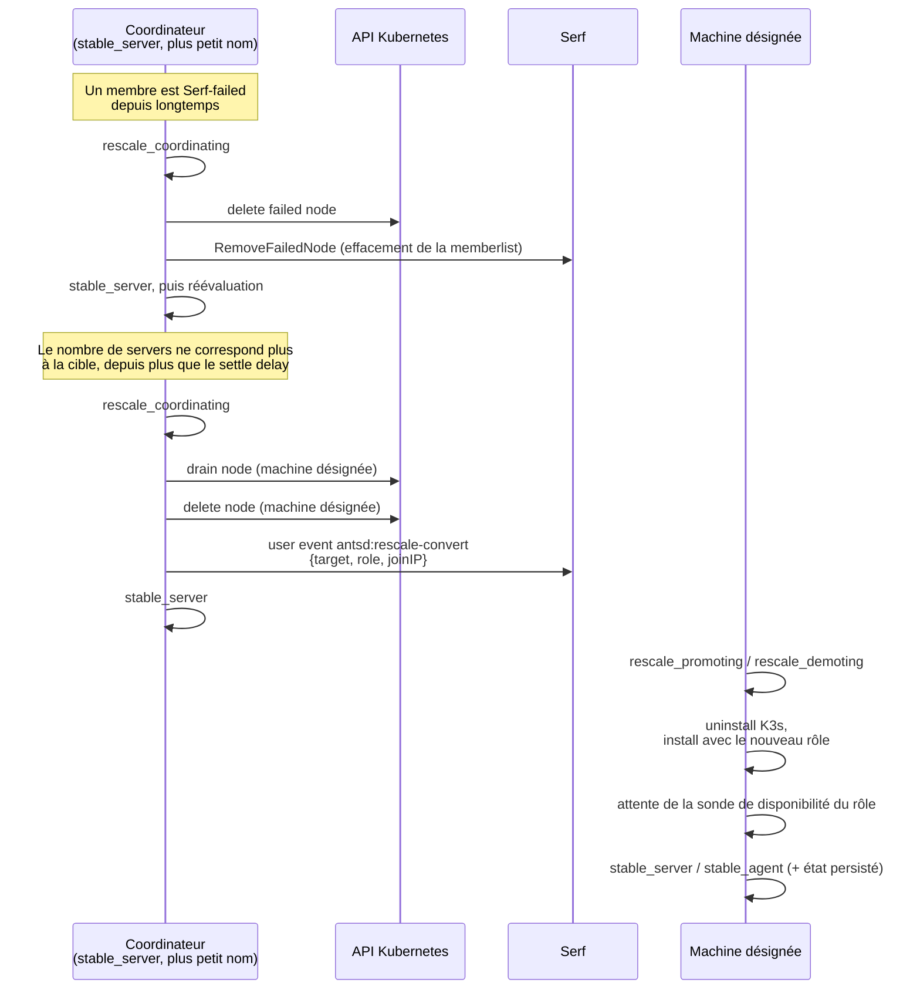

# Redimensionnement du cluster (rescaling)

Ce fichier décrit ce qui se passe après le premier démarrage et après que K3s soit installé,
quand la population du cluster change : une machine tombe en panne durablement, ou une nouvelle machine est ajoutée.

## Pourquoi ce workflow existe

K3s ne retire jamais de lui-même une machine définitivement failed.
C'est normalement une tache manuelle (humaine).

Le rescaling fait cette intervention : antsd joue le rôle de l'administrateur qui se connecterait en SSH.
Il a deux effets complémentaires :

1. rendre le cluster à sa topologie optimale après la perte durable d'une machine
2. faire grandir le control plane quand des machines sont ajoutées.

Les deux se font sans aucune action de l'utilisateur.

## Le nombre visé de servers : le plus grand impair qui rentre

`node.DesiredServerCount(population)` renvoie le plus grand nombre impair inférieur ou égal à `min(population, 7)` :

| Population | 1 | 2 | 3 | 4 | 5 | 6 | 7 | 8+ |
|------------|---|---|---|---|---|---|---|----|
| Servers    | 1 | 1 | 3 | 3 | 5 | 5 | 7 | 7  |

Explication des deux propriétés :

- **Nombre est impair :** un groupe etcd pair ne tolère pas plus de pannes que l'impair juste en dessous (quatre
  membres exigent un quorum de trois, exactement comme cinq) tout en augmentant la surface sur laquelle une panne peut
  arriver.
- **Maximum est sept :** c'est le max recommandé par etcd.

## États

Quatre états, tous préfixés `rescale_` :

- `rescale_coordinating` : cette machine gère un tour de réparation (éviction des machines
  perdues, puis désignation de la machine qui change de rôle). Elle reste un server pendant ce temps
- `rescale_promoting` : cette machine a été désignée pour agrandir le control plane (agent → server)
- `rescale_demoting` : cette machine a été désignée pour le réduire (server → agent). Elle **ne compte plus** comme
  server dès qu'elle entre dans cet état
- `rescale_failed` : état terminal, la conversion locale (promoting ou demoting) a échoué.

## Qui décide

Toutes les machines évaluent le cluster à chaque événement Serf et à chaque expiration de minuteur, mais seul le
`stable_server` vivant au plus petit nom agit. Chaque machine dérive le même coordinateur avec la même liste
membership, comme pour le rang du bootstrap.

Le compteur `imbalanceControlPlaneSince` ne tourne que sur le coordinateur, et seulement tant qu'il est
`stable_server`. Il repart de zéro dès qu'il perd le tour. Une machine qui vient tout juste d'etre `stable_server` doit
donc observer l'écart pendant tout `rescale-settle-delay` avant d'agir : la machine promue ne rejoint jamais un server
fraîchement stabilisé.

Grâce à `isEtcdMembershipChanging()`, on s'assure qu'aucun autre membre n'est en train de faire une action qui rend
etcd indisponible pour un changement de role (qui implique une suppression ou ajout de membre etcd).

Attention avec ce mutex : tout état qui le prend doit avoir une durée bornée.
Le test du mutex précède le rescaling, donc une machine immobilisée dans un de ces états gèle toutes les
réparations du cluster (y compris celle qui la débloquerait).
Les installations, les conversions et le redémarrage sont bornés et tombent dans un état terminal qui libère le mutex.

`rescale_coordinating` à un timeout, mais son expiration n'est pas terminale : le tour est abandonné, la machine
redevient `stable_server` et le prochain coordinateur refait le travail.
Le délai est donc bien plus court que celle d'une installation.
Elle est nécessaire parce que le coordinateur y appelle kubectl, qui pourrait rester bloqué.

### Le coordinateur n'agit que si le quorum est ok

L'élection est faite à partir de la vue Serf locale, qui est celle d'une seule machine.
Dans le cas d'un isolement réseau d'une machine ou d'un split brain, plusieurs coordinateurs pourraient être élus.
Pour éviter qu'un coordinateur illégitime effectue une action, on a un check qui repose sur l'api K3s.

Chaque tour de coordination commence par un appel kubectl en lecture seule.
etcd n'autorise pas de lecture si le quorum n'est pas ok, donc cet appel réussit du côté majoritaire et échoue du côté
minoritaire :
Un tour refusé est abandonné comme n'importe quel autre tour, et il est réessayé plus tard.

## Chorégraphie

### 1. Éviction

Le coordinateur retire toute machine Serf-failed depuis plus longtemps que `EvictionGrace` :

- suppression au sein de K3s via kubectl
- puis au sein de Serf, qui l'efface de la memberlist sur toutes les machines : elle n'existe donc plus du tout.

Serf n'expose pas de timestamps de la date d'une panne (meme si en interne, cela existe) : chaque machine mesure donc la
durée localement, depuis la première fois qu'elle a vu le membre en panne.
Une machine qui revient avant la fin de la période `EvictionGrace` repart de zéro.

### 2. Éviction passe avant la conversion

Promouvoir sans avoir retiré le membre etcd mort fait passer d'un groupe de 3 (un mort, quorum 2) à un groupe de 4
(un mort, quorum 3) : toujours trois vivants pour un quorum de trois, donc la promotion n'ajoute aucune tolérance.
C'est une opération risquée, déconseillé par etcd.

### 3. Conversion

Si, après éviction, le nombre de servers ne correspond plus à la cible depuis plus que `rescale-settle-delay`, le
coordinateur désigne une machine :

|                           | Promotion (agent → server)                           | Rétrogradation (server → agent)                     |
|---------------------------|------------------------------------------------------|-----------------------------------------------------|
| Cible choisie             | le `stable_agent` vivant au plus petit nom           | le `stable_server` vivant au plus **grand** nom     |
| Travail du coordinateur   | drain + delete node                                  | drain + delete node                                 |
| Travail local de la cible | uninstall agent → install server → `WaitServerReady` | uninstall server → install agent → `WaitAgentReady` |
| Arrivée                   | `stable_server`                                      | `stable_agent`                                      |

L'ordre est diffusé par le user event `antsd:rescale-convert`, avec `{target, role, joinIP}` en payload.

Le coordinateur retourne à `stable_server` juste après la diffusion.

### 4. Une réparation qui échoue

Deux traitements distincts :

- le coordinateur abandonne son tour et réessaie. Un tour de coordination ne touche pas à son propre K3s, qui
  continue de servir : donc pas d'état terminal. Si cette machine devient incapable d'agir, le server suivant au plus
  petit nom prend le tour tout seul.
- la machine convertie bascule en `rescale_failed`. Son installation K3s a été détruite et celle qui
  devait la remplacer n'est pas up : plus rien de local n'est fiable.

## Prune plutôt que force-leave : `left` reste pour le décommissionnement

Il y a donc désormais **trois** status Serf à distinguer :

| Issue                 | Signification                                   |
|-----------------------|-------------------------------------------------|
| `failed`              | la machine a disparu, elle peut revenir         |
| `left`                | la machine a été décommissionnée volontairement |
| absente du memberlist | la machine a été évincée par le rescaling       |

## La préservation des assets air-gap dans le vault

Les scripts `k3s-uninstall.sh` / `k3s-agent-uninstall.sh` suppriment `/usr/local/bin/k3s` et les archive d'images
air-gap. Mais ces fichiers sont requis par `install-k3s.sh` avec `INSTALL_K3S_SKIP_DOWNLOAD=true` : sans eux, la machine
incapable de réinstaller (pas d'accès internet pour download les assets).

L'image ants-os a donc une copie intacte dans `/usr/lib/ants/k3s/`, un emplacement auquel K3s ne touche jamais, et
`ExecInstaller.stageAirGapAssets` les remet en place avant chaque installation.

## Limites connues

1. **Une machine évincée qui revient est un zombie.** Elle rejoint Serf en `alive`, mais son K3s ne peut pas rejoindre
   un cluster etcd dont il a été retiré. Elle ne bloque pas le reste du système : `rejoinTimeout`
   la fait tomber en `rejoin_failed`, qui ne prend pas le mutex. La machine elle-même reste perdue et sa
   récupération passe par une réinitialisation d'usine.
2. **Fenêtre de crash entre la réinstallation et la persistance.** Un crash après une conversion réussie mais avant
   l'écriture du fichier d'état laisse disque = server et état persisté = agent, donc `rejoin_failed` au redémarrage.
   L'état n'est écrit qu'après la disponibilité (comme le fait déjà `becomeStable`).

